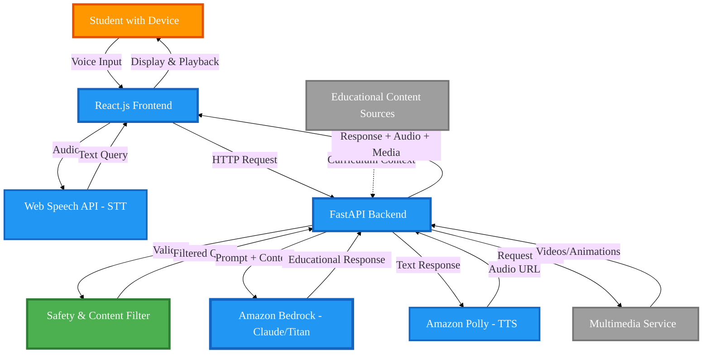
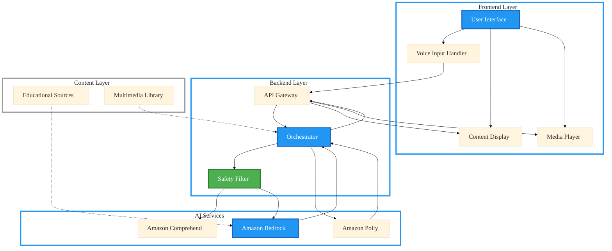
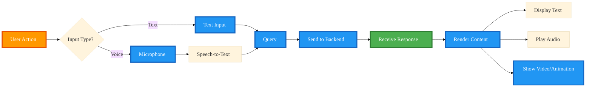
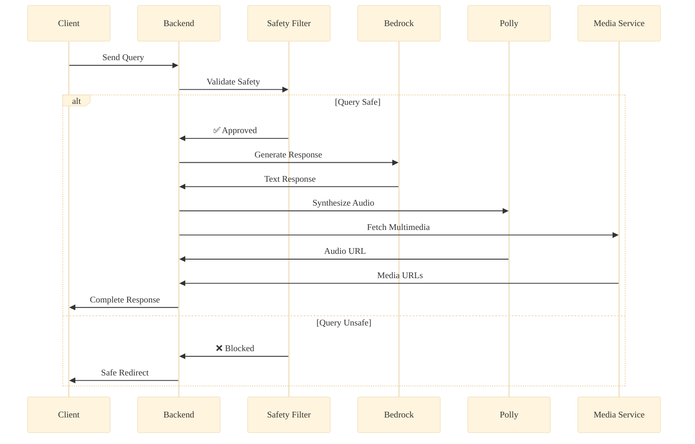
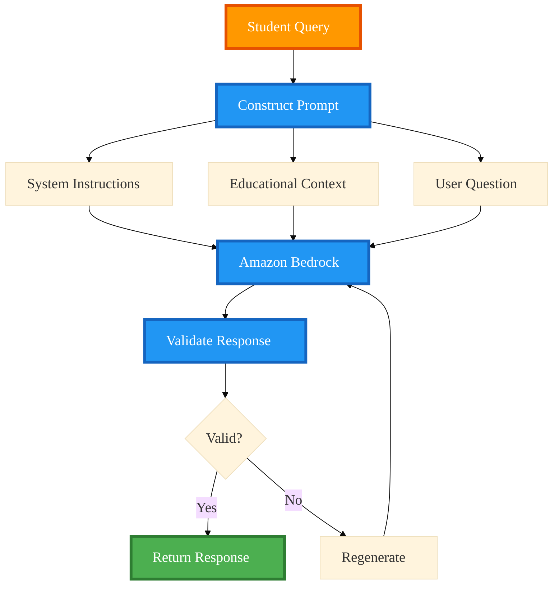
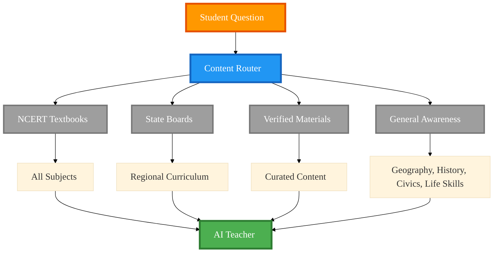
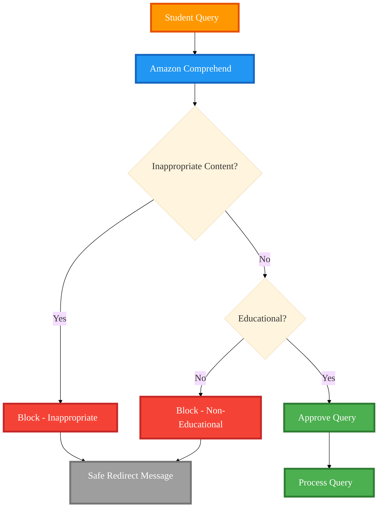
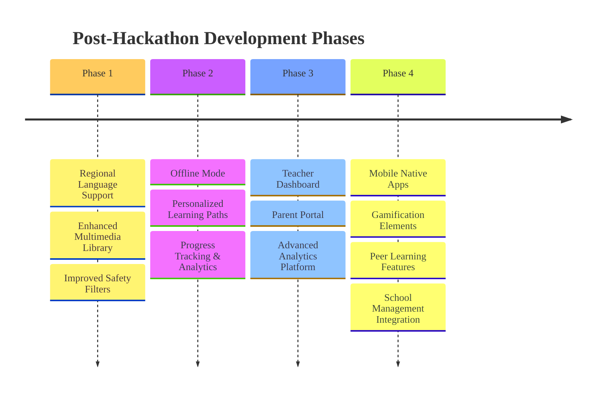

# Design Document: Sarvasiksha AI

**Document Version:** 1.0  
**Last Updated:** 2026  
**Status:** Active  
**Classification:** Internal Design Specification

---

## Table of Contents

1. [Overview](#overview)
2. [Design Principles](#design-principles)
3. [Architecture](#architecture)
4. [Technology Stack](#technology-stack)
5. [Components and Interfaces](#components-and-interfaces)
6. [Data Flow](#data-flow)
7. [Future Enhancements](#future-enhancements)

---

## Overview

Sarvasiksha AI is a voice-based, child-safe AI learning system designed specifically for underprivileged Indian school students. The platform delivers interactive education across all core subjects and general awareness topics relevant to Indian children, leveraging a cloud-first architecture built on AWS services.

### System Purpose

The system enables students to:
- Ask questions using voice input in Hindi or English
- Receive curriculum-aligned explanations from an AI teacher enhanced with videos, animations, and interactive visualizations
- Access responses through text-to-speech audio playback
- Benefit from multiple safety layers ensuring all interactions remain educational and age-appropriate

### Key Objectives

- **Accessibility**: Voice-first interface for students with limited literacy or device familiarity
- **Safety**: Multi-layered content filtering and moderation
- **Quality**: Curriculum-aligned educational content from trusted sources
- **Engagement**: Rich multimedia content to enhance learning outcomes
- **Scalability**: Cloud-based architecture supporting growth
- **Cost Efficiency**: Leveraging AWS Free Tier and cost-optimized services

---

## Use Case Diagram

The following diagram illustrates the primary use cases and actors in the Sarvasiksha AI system:

```mermaid
%%{init: {'theme':'base', 'themeVariables': {'fontSize':'20px', 'fontFamily':'Arial, Helvetica, sans-serif'}}}%%
graph TB
    subgraph Actors[" "]
        Student[🎤 Student<br/>Primary Actor]
        System[⚙️ Sarvasiksha AI System]
    end
    
    subgraph UseCases["Use Cases"]
        UC1[📢 Ask Question via Voice<br/>Voice Input Processing]
        UC2[⌨️ Ask Question via Text<br/>Text Input Fallback]
        UC3[🎓 Receive Educational Response<br/>Curriculum-Aligned Answer]
        UC4[🔊 Listen to Audio Response<br/>Text-to-Speech Playback]
        UC5[🎬 View Multimedia Content<br/>Videos, Animations, Diagrams]
        UC6[🔄 Request Clarification<br/>Follow-up Questions]
        UC7[🛡️ Content Safety Validation<br/>Automatic Content Filtering]
        UC8[🌐 Language Detection<br/>Hindi/English Support]
        UC9[📚 Access Curriculum Content<br/>NCERT & State Board Materials]
        UC10[💬 Maintain Conversation Context<br/>Multi-turn Interactions]
    end
    
    subgraph SystemComponents["System Components"]
        Frontend[💻 Frontend UI]
        Backend[⚙️ Backend API]
        Safety[🛡️ Safety Filter]
        AI[🤖 AI Teacher]
        TTS[🔊 Text-to-Speech]
        Media[🎬 Media Service]
    end
    
    Student -->|Uses| UC1
    Student -->|Uses| UC2
    Student -->|Receives| UC3
    Student -->|Uses| UC4
    Student -->|Views| UC5
    Student -->|Requests| UC6
    Student -->|Benefits from| UC7
    Student -->|Uses| UC8
    Student -->|Accesses| UC9
    Student -->|Engages in| UC10
    
    UC1 -->|Implemented by| Frontend
    UC2 -->|Implemented by| Frontend
    UC3 -->|Implemented by| AI
    UC4 -->|Implemented by| TTS
    UC5 -->|Implemented by| Media
    UC6 -->|Implemented by| Backend
    UC7 -->|Implemented by| Safety
    UC8 -->|Implemented by| Frontend
    UC9 -->|Implemented by| Backend
    UC10 -->|Implemented by| Backend
    
    Frontend -->|Communicates with| Backend
    Backend -->|Validates via| Safety
    Backend -->|Generates via| AI
    Backend -->|Synthesizes via| TTS
    Backend -->|Fetches from| Media
    
    System -.->|Orchestrates| Frontend
    System -.->|Orchestrates| Backend
    System -.->|Orchestrates| Safety
    System -.->|Orchestrates| AI
    System -.->|Orchestrates| TTS
    System -.->|Orchestrates| Media
    
    style Student fill:#FF9800,stroke:#E65100,stroke-width:4px,color:#fff
    style System fill:#2196F3,stroke:#1565C0,stroke-width:4px,color:#fff
    style UC1 fill:#4CAF50,stroke:#2E7D32,stroke-width:3px,color:#fff
    style UC2 fill:#4CAF50,stroke:#2E7D32,stroke-width:3px,color:#fff
    style UC3 fill:#4CAF50,stroke:#2E7D32,stroke-width:3px,color:#fff
    style UC4 fill:#4CAF50,stroke:#2E7D32,stroke-width:3px,color:#fff
    style UC5 fill:#4CAF50,stroke:#2E7D32,stroke-width:3px,color:#fff
    style UC6 fill:#4CAF50,stroke:#2E7D32,stroke-width:3px,color:#fff
    style UC7 fill:#f44336,stroke:#C62828,stroke-width:3px,color:#fff
    style UC8 fill:#4CAF50,stroke:#2E7D32,stroke-width:3px,color:#fff
    style UC9 fill:#4CAF50,stroke:#2E7D32,stroke-width:3px,color:#fff
    style UC10 fill:#4CAF50,stroke:#2E7D32,stroke-width:3px,color:#fff
    style Frontend fill:#2196F3,stroke:#1565C0,stroke-width:3px,color:#fff
    style Backend fill:#2196F3,stroke:#1565C0,stroke-width:3px,color:#fff
    style Safety fill:#f44336,stroke:#C62828,stroke-width:3px,color:#fff
    style AI fill:#2196F3,stroke:#1565C0,stroke-width:3px,color:#fff
    style TTS fill:#2196F3,stroke:#1565C0,stroke-width:3px,color:#fff
    style Media fill:#2196F3,stroke:#1565C0,stroke-width:3px,color:#fff
```



### Use Case Descriptions

**Primary Use Cases:**

1. **Ask Question via Voice**: Student speaks a question in Hindi or English, which is captured and processed
2. **Ask Question via Text**: Fallback text input when voice recognition fails
3. **Receive Educational Response**: Get curriculum-aligned answers from AI teacher
4. **Listen to Audio Response**: Audio playback of text responses via TTS
5. **View Multimedia Content**: Access videos, animations, and diagrams
6. **Request Clarification**: Ask follow-up questions for better understanding
7. **Content Safety Validation**: Automatic filtering of inappropriate content
8. **Language Detection**: Automatic detection and support for Hindi/English
9. **Access Curriculum Content**: Content aligned with NCERT and state boards
10. **Maintain Conversation Context**: Multi-turn conversations with context retention

---

## Design Principles

The following principles guide all design decisions for Sarvasiksha AI:

1. **Simplicity over Completeness**
   - Focus on core functionality with scalable architecture
   - Avoid feature bloat that could compromise performance or usability

2. **Low-Cost and Efficient**
   - Leverage AWS Free Tier and cost-efficient services
   - Optimize resource utilization to minimize operational costs

3. **Child Safety by Design**
   - Multiple validation layers to ensure appropriate content
   - Proactive content filtering and moderation at every stage

4. **Curriculum-Aligned AI Responses**
   - Guardrails to ensure alignment with trusted educational sources
   - Validation against NCERT and state board standards

5. **Cloud-First with Future Offline Support**
   - Web-based architecture with potential for offline capabilities
   - Progressive enhancement for low-connectivity scenarios

6. **Scalable Content Coverage**
   - Support multiple subjects and general awareness topics
   - Extensible architecture for content expansion

7. **Engaging Multimedia**
   - Videos, animations, and interactive content to enhance learning
   - Contextual media selection based on topic complexity

---

## Architecture

### High-Level Architecture

The system follows a layered architecture pattern with clear separation of concerns:



### Architecture Layers

1. **Presentation Layer**: React.js frontend with voice input capabilities
2. **Application Layer**: FastAPI backend orchestrating business logic
3. **AI Services Layer**: Amazon Bedrock, Polly, and Comprehend integration
4. **Content Layer**: Educational sources and multimedia library
5. **Infrastructure Layer**: AWS compute and storage services

---

## Technology Stack

### Frontend Technologies

| Component | Technology | Purpose |
|-----------|-----------|---------|
| **UI Framework** | React.js | Component-based UI architecture and state management |
| **Speech Recognition** | Web Speech API | Browser-based speech-to-text conversion |
| **Audio Playback** | HTML5 Audio API | Native audio playback controls |
| **Styling** | Responsive CSS | Mobile-first responsive design |

### Backend Technologies

| Component | Technology | Purpose |
|-----------|-----------|---------|
| **Framework** | FastAPI (Python 3.11+) | High-performance async API framework |
| **Validation** | Pydantic | Type-safe request/response validation |
| **AWS Integration** | boto3 (AWS SDK) | Comprehensive AWS service integration |

### AI & Speech Services

| Service | Technology | Purpose |
|---------|-----------|---------|
| **AI/LLM** | Amazon Bedrock (Claude 3 Haiku / Titan) | Educational response generation |
| **Text-to-Speech** | Amazon Polly | High-quality voice synthesis |
| **Content Moderation** | Amazon Comprehend | Safety filtering and content analysis |
| **Speech-to-Text** | Web Speech API | Client-side voice transcription |

### Infrastructure

| Component | Technology | Purpose |
|-----------|-----------|---------|
| **Compute** | AWS Lambda / EC2 | Scalable backend hosting |
| **Configuration** | Environment Variables | Secure credential management |
| **Networking** | HTTPS/TLS | Encrypted communication |

### Technology Stack Overview

| **Category** | **Technology** | **Purpose** | **Rationale** |
|--------------|----------------|-------------|---------------|
| **Frontend Framework** | React.js | UI components and state management | Component-based architecture, large ecosystem, easy to learn |
| **Speech-to-Text** | Web Speech API | Convert voice to text (client-side) | Zero cost, low latency, browser-native, no server processing needed |
| **Text-to-Speech** | Amazon Polly | Convert text responses to audio | High-quality Indian accent voices, supports Hindi & English, scalable |
| **AI/LLM** | Amazon Bedrock (Claude 3 Haiku / Titan) | Generate educational responses | Cost-efficient, curriculum-focused, guardrails support, AWS integration |
| **Content Moderation** | Amazon Comprehend | Safety filtering and content analysis | AI-powered sentiment analysis, child safety, detects inappropriate content |
| **Backend Framework** | FastAPI (Python 3.11+) | API orchestration and business logic | Fast, async support, automatic API docs, easy AWS integration |
| **Validation** | Pydantic | Request/response validation | Type safety, automatic validation, works seamlessly with FastAPI |
| **Cloud Services** | AWS SDK (boto3) | Integration with AWS services | Official AWS SDK, comprehensive service coverage |
| **Compute** | AWS Lambda / EC2 | Backend hosting | Lambda: serverless, auto-scaling, pay-per-use; EC2: more control if needed |
| **Audio Playback** | HTML5 Audio API | Play audio responses | Browser-native, no dependencies, universal support |
| **Styling** | Responsive CSS | Mobile-first UI design | Works on low-end devices, small screens, lightweight |
| **Configuration** | Environment Variables | Secure credential management | Industry standard, keeps secrets out of code, easy deployment |

### Key Technology Benefits

#### Cost Efficiency
- **Web Speech API**: Free, browser-based solution eliminates server-side STT costs
- **AWS Free Tier**: Eligible services reduce initial operational costs
- **Serverless Architecture**: Pay-per-use model with automatic scaling

#### Performance
- **Client-Side STT**: Reduces server load and improves response times
- **AWS Services**: Low-latency managed services with global infrastructure
- **CDN Delivery**: Fast static asset delivery for improved user experience

#### Scalability
- **Serverless Auto-Scaling**: Lambda automatically handles traffic spikes
- **AWS Managed Services**: Built-in scalability for all integrated services
- **Stateless API Design**: Horizontal scaling without session management complexity

#### Security
- **Amazon Comprehend**: AI-powered content safety and moderation
- **Environment-Based Secrets**: Secure credential management following industry best practices
- **HTTPS Encryption**: End-to-end encrypted communication channels

---

## Components and Interfaces

### Component Architecture Overview

The system is organized into four primary layers:



### 1. Frontend Component (React.js)

#### Responsibilities
- Capture voice input using device microphone
- Convert speech to text using Web Speech API
- Display conversation history and responses
- Play audio responses and multimedia content
- Provide fallback text input option
- Handle loading states and error messages

#### Frontend Flow



### 2. Speech Layer

#### Speech-to-Text (STT)

- **Technology**: Web Speech API (browser-based)
- **Languages Supported**: 
  - Hindi (`hi-IN`)
  - English (`en-IN`)
- **Advantages**: 
  - Zero cost implementation
  - Low latency processing
  - No server-side processing required
  - Native browser support

#### Text-to-Speech (TTS)

- **Technology**: Amazon Polly
- **Voice Selection**: Language-appropriate Indian accent voices
- **Output Format**: MP3 audio stream
- **Quality**: High-fidelity natural-sounding speech

#### Speech Processing Pipeline


### 3. Backend & Orchestration Layer

#### Responsibilities
- Receive and validate student queries
- Orchestrate safety filtering using Amazon Comprehend
- Construct AI prompts with educational context
- Invoke Amazon Bedrock for AI responses
- Generate audio using Amazon Polly
- Fetch and deliver multimedia content
- Return structured responses to frontend

#### Core Orchestration Flow



### 4. AI & Prompt Guardrail Layer

#### Amazon Bedrock Configuration

- **Model Selection**: Claude 3 Haiku (cost-efficient) or Amazon Titan
- **Temperature**: 0.3 (deterministic, curriculum-focused responses)
- **Max Tokens**: 500 (limits response length for clarity)
- **Top-P**: 0.9 (balanced creativity and consistency)

#### AI Processing Flow



#### Guardrail Mechanisms

The system implements multiple guardrails to ensure safe, appropriate, and educational responses:


**Guardrail Components:**
1. **Topic Boundaries**: Restrict responses to educational topics only
2. **Vocabulary Level**: Ensure age-appropriate language
3. **Length Limits**: Maintain concise, focused responses
4. **Content Validation**: Post-generation safety checks

### 5. Curriculum & Knowledge Source Layer

#### Content Architecture



#### Content Sources

- **NCERT Textbooks**: Standardized curriculum across India
- **State Board Materials**: Regional curriculum adaptations
- **Verified Educational Content**: Government-approved resources
- **General Awareness**: Geography, civics, history, current affairs, life skills

### 6. Safety & Moderation Layer

#### Content Filter Implementation

The safety layer implements a multi-stage filtering process:



**Safety Mechanisms:**
1. **Content Moderation**: Amazon Comprehend analyzes queries for inappropriate content
2. **Educational Validation**: Ensures queries are educationally relevant
3. **Response Validation**: Post-generation checks on AI responses
4. **Safe Redirects**: User-friendly messages for blocked content

---

## Data Flow

### End-to-End Interaction Flow

The complete interaction flow from student voice input to response delivery:

```mermaid
%%{init: {'theme':'base', 'themeVariables': {'fontSize':'24px', 'fontFamily':'Arial, Helvetica, sans-serif', 'actorBkg':'#2196F3', 'actorBorder':'#1565C0', 'actorTextColor':'#fff', 'actorLineColor':'#2196F3', 'signalColor':'#4CAF50', 'signalTextColor':'#fff', 'labelBoxBkgColor':'#FF9800', 'labelBoxBorderColor':'#E65100', 'labelTextColor':'#fff', 'loopTextColor':'#fff', 'noteBkgColor':'#4CAF50', 'noteTextColor':'#fff', 'activationBkgColor':'#2196F3', 'activationBorderColor':'#1565C0'}}}%%
sequenceDiagram
    autonumber
    participant S as 🎤 Student
    participant F as 💻 Frontend
    participant W as 🗣️ Web Speech API
    participant B as ⚙️ Backend API
    participant SF as 🛡️ Safety Filter
    participant BR as 🤖 Amazon Bedrock
    participant P as 🔊 Amazon Polly
    participant M as 🎬 Media Service
    
    rect rgb(255, 248, 220)
        Note over S,F: Student Interaction Phase
        S->>+F: 🎤 Speaks question (voice)
        activate F
        F->>+W: Start voice recording
        activate W
        W-->>-F: ✅ Transcribed text + language detected
        deactivate W
        F-->>-S: 📝 Show transcribed text
        deactivate F
    end
    
    rect rgb(227, 242, 253)
        Note over F,B: API Request Phase
        F->>+B: 📤 POST /api/ask<br/>{query, language, timestamp}
        activate B
    end
    
    rect rgb(255, 245, 238)
        Note over B,SF: Safety Validation Phase
        B->>+SF: 🔍 Validate query content
        activate SF
        SF->>SF: Check inappropriate content
        SF->>SF: Verify educational relevance
    alt Query is unsafe/off-topic
            SF-->>-B: ❌ BLOCKED<br/>{reason: inappropriate/non-educational}
            deactivate SF
            B-->>-F: 🚫 Response {blocked: true, reason, safe_message}
            deactivate B
            F->>S: ⚠️ Display safe redirect message
        else Query is safe and educational
            SF-->>-B: ✅ APPROVED<br/>{status: safe, category: educational}
            deactivate SF
    end
    
    rect rgb(232, 245, 233)
        Note over B,BR: AI Processing Phase
        B->>+BR: 🤖 Invoke Claude 3 Haiku<br/>{prompt: educational_context + query}
        activate BR
        BR->>BR: Generate curriculum-aligned response
        BR-->>-B: 📝 Educational response text<br/>{text, subject, grade_level}
        deactivate BR
    end
    
    rect rgb(240, 248, 255)
        Note over B,M: Content Generation Phase
        par Generate Audio in Parallel
            B->>+P: 🔊 Synthesize speech<br/>{text, language, voice_id}
            activate P
            P->>P: Generate MP3 audio stream
            P-->>-B: 🎵 Audio URL<br/>{audio_url, duration, format}
            deactivate P
        and Fetch Multimedia in Parallel
            B->>+M: 🎬 Request multimedia<br/>{topic, subject, complexity}
            activate M
            M->>M: Search media library
            M-->>-B: 📹 Media URLs<br/>{videos: [], animations: [], diagrams: []}
            deactivate M
        end
    end
    
    rect rgb(255, 248, 220)
        Note over B,S: Response Delivery Phase
        B->>B: Assemble complete response
        B-->>-F: 📦 Complete Response<br/>{text, audio_url, media_urls, metadata}
        deactivate B
        F->>F: Parse and prepare UI
        F->>S: 📱 Display formatted text
        F->>S: 🔊 Auto-play audio response
        F->>S: 🎬 Show videos/animations
        F->>S: ✅ Learning complete
    end
```

### Data Flow Stages

1. **Input Capture**: Voice input captured via browser microphone
2. **Speech Recognition**: Web Speech API converts audio to text
3. **API Transmission**: Text query sent to backend via HTTPS
4. **Safety Validation**: Multi-stage content filtering
5. **AI Processing**: Educational response generation
6. **Content Enhancement**: Audio and multimedia generation
7. **Response Delivery**: Complete response package delivered to frontend
8. **User Presentation**: Text, audio, and media displayed to student

---

## Future Enhancements

### Hackathon Scope (Current Phase)

**Core Features:**
- Voice-based interaction (Hindi & English)
- Basic safety filtering with Amazon Comprehend
- Educational responses for core subjects
- Text-to-speech responses
- Simple multimedia support

### Post-Hackathon Roadmap



#### Phase 1 - Enhanced Content & Languages

- **Regional Language Support**: Multiple Indian languages (Tamil, Telugu, Bengali, Marathi, etc.)
- **Expanded Multimedia Library**: Comprehensive video and animation collection
- **Advanced Content Moderation**: Enhanced safety filters with machine learning

#### Phase 2 - Personalization & Offline

- **Offline Mode**: Cached content for low-connectivity scenarios
- **Personalized Learning Paths**: Adaptive learning based on student performance
- **Progress Tracking**: Detailed analytics and learning insights
- **Adaptive Difficulty**: Dynamic difficulty adjustment

#### Phase 3 - Dashboards & Monitoring

- **Teacher Dashboard**: Monitor student progress and engagement
- **Parent Portal**: Track learning outcomes and achievements
- **Advanced Analytics**: Comprehensive insights and reporting
- **Performance Reports**: Automated recommendations and insights

#### Phase 4 - Mobile & Advanced Features

- **Native Mobile Apps**: Android and iOS applications
- **Gamification**: Badges, rewards, and leaderboards
- **Peer Learning**: Collaboration and social learning features
- **School Integration**: Integration with school management systems
- **Community Features**: Forums and discussion boards for students and teachers

---


