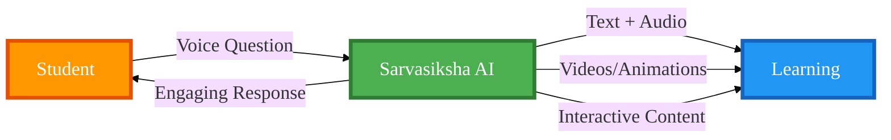
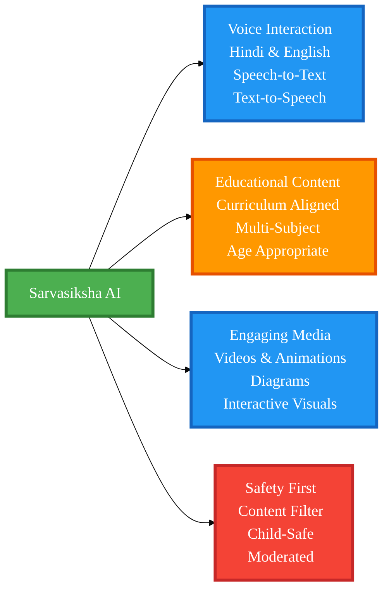
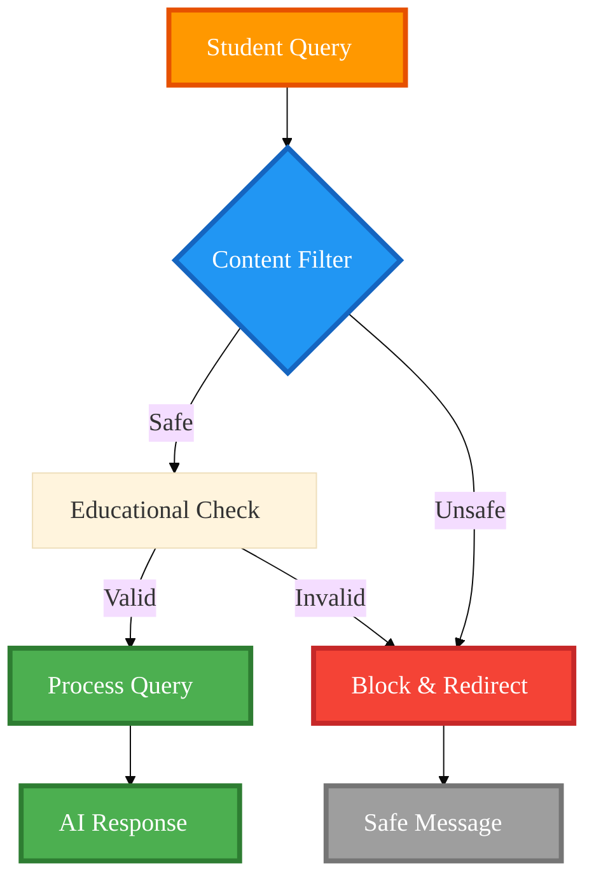
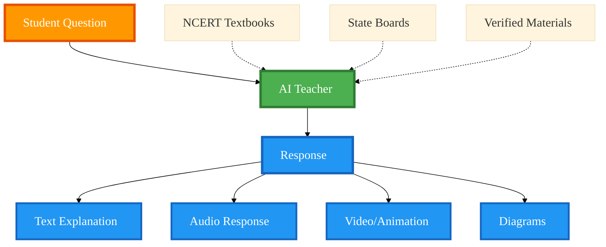
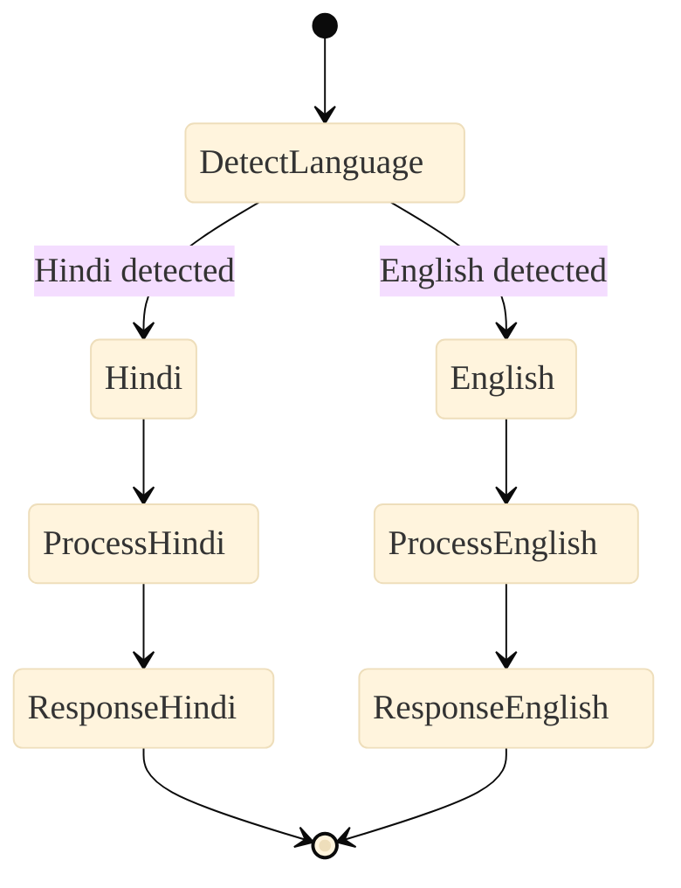
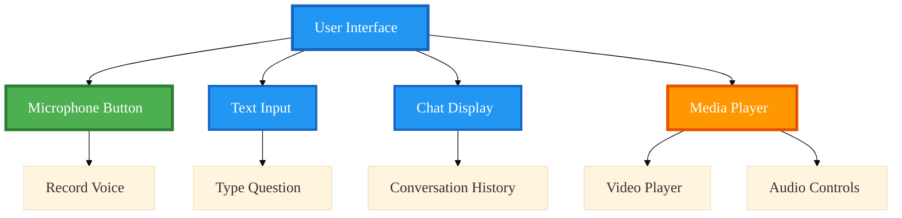
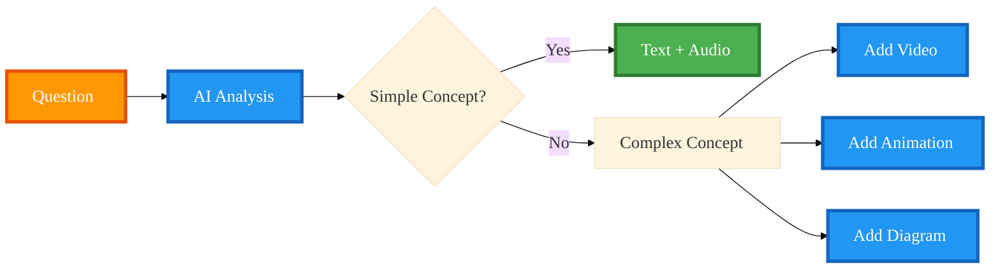
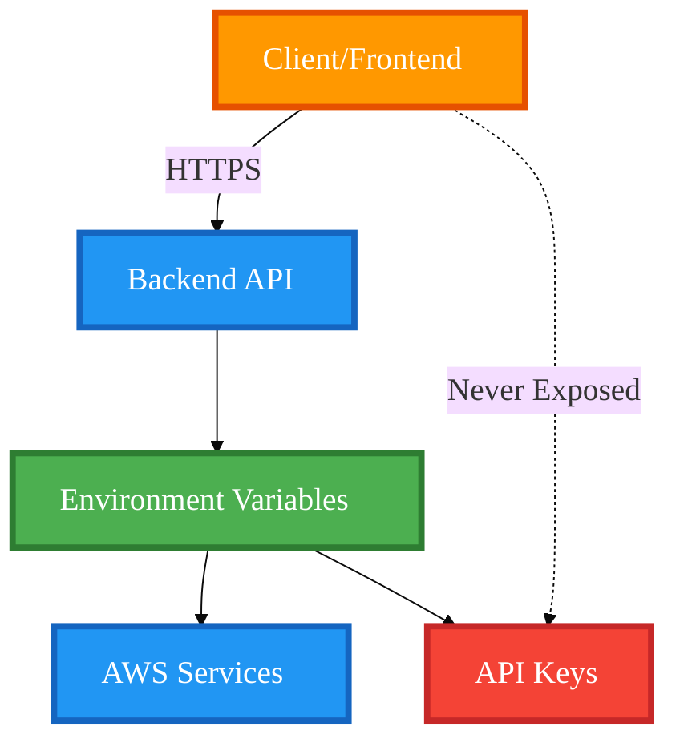

# Requirements Document: Sarvasiksha AI

## Introduction

Sarvasiksha AI is a voice-based, child-safe AI teacher designed for underprivileged Indian school students. The system provides interactive education across core subjects (Mathematics, Science, Social Studies) and general awareness topics relevant to Indian children. The system supports voice-based interactions in Hindi and English, with engaging multimedia content including videos, animations, and interactive visualizations, all protected by built-in safety mechanisms to ensure child-appropriate content.

### System Vision



### Key Features at a Glance



## Glossary

- **Student**: A school student from an underprivileged background, primarily Hindi-medium
- **System**: The Sarvasiksha AI voice-based teaching platform
- **STT_Engine**: Speech-to-Text conversion component
- **TTS_Engine**: Text-to-Speech conversion component
- **AI_Teacher**: The AI component that generates educational responses
- **Content_Filter**: The safety mechanism that blocks inappropriate content
- **Educational_Content**: Content from trusted educational sources including NCERT, state boards, and verified educational materials for school students
- **Multimedia_Content**: Videos, animations, diagrams, and interactive visualizations to enhance learning
- **General_Awareness_Content**: Age-appropriate knowledge about India, current affairs, civics, and life skills
- **Voice_Input**: Audio recording of student's spoken question
- **Text_Query**: Textual representation of student's question after STT conversion
- **Educational_Response**: AI-generated answer aligned with trusted educational sources and curriculum standards, optionally enhanced with multimedia
- **Audio_Response**: Spoken version of the educational response via TTS

## Requirements

### 1. Voice Input Processing
The system must support voice-based question input with speech-to-text conversion for Hindi and English languages, with text input fallback when voice fails.

**Interaction Flow:**
```mermaid
%%{init: {'theme':'base', 'themeVariables': {'fontSize':'24px', 'fontFamily':'Arial, Helvetica, sans-serif', 'actorBkg':'#2196F3', 'actorBorder':'#1565C0', 'actorTextColor':'#fff', 'actorLineColor':'#2196F3', 'signalColor':'#4CAF50', 'signalTextColor':'#fff', 'labelBoxBkgColor':'#FF9800', 'labelBoxBorderColor':'#E65100', 'labelTextColor':'#fff', 'loopTextColor':'#fff', 'noteBkgColor':'#4CAF50', 'noteTextColor':'#fff', 'activationBkgColor':'#2196F3', 'activationBorderColor':'#1565C0'}}}%%
sequenceDiagram
    autonumber
    participant S as 🎤 Student
    participant V as 🎙️ Voice Input Handler
    participant STT as 🗣️ Speech-to-Text
    participant SYS as ⚙️ System Backend
    
    rect rgb(255, 248, 220)
        Note over S,V: Voice Input Capture
        S->>+V: 🎤 Speaks question<br/>(Hindi or English)
        activate V
        V->>V: Capture audio stream
        V->>V: Detect language
    end
    
    rect rgb(227, 242, 253)
        Note over V,STT: Speech Recognition
        V->>+STT: 📡 Send audio stream<br/>{audio, language, sample_rate}
        activate STT
        STT->>STT: Process audio waveform
        STT->>STT: Convert to text
        STT->>STT: Detect confidence score
    end
    
    rect rgb(232, 245, 233)
        Note over STT,SYS: Query Processing
        alt STT Success (confidence > 0.7)
            STT-->>-V: ✅ Transcribed text<br/>{text, language, confidence}
            deactivate STT
            V-->>-S: 📝 Display transcribed text
            deactivate V
            V->>+SYS: 📤 Send query<br/>{text, language, timestamp}
            activate SYS
            SYS->>SYS: Validate and process
            SYS-->>-S: ✅ Process query successfully
            deactivate SYS
        else STT Fails (confidence < 0.7 or error)
            STT-->>-V: ❌ Recognition failed<br/>{error, confidence}
            deactivate STT
            V-->>-S: ⚠️ Show text input fallback
            deactivate V
            S->>+SYS: ⌨️ Type question manually
            activate SYS
            SYS->>SYS: Process text query
            SYS-->>-S: ✅ Process query successfully
            deactivate SYS
        end
    end
```

### 2. Content Safety and Filtering
The system must filter and block non-educational and inappropriate content to ensure child safety using AWS Comprehend for content moderation. All queries must be validated before processing, and blocked queries should be logged without storing sensitive content.

**Safety Pipeline:**


### 3. Curriculum-Aligned Educational Responses
The system must generate educational responses aligned with trusted educational sources and curriculum standards for school students across all core subjects and general awareness topics. Responses should use age-appropriate vocabulary, include daily-life examples from Indian context, be structured in step-by-step format, and be enhanced with multimedia content (videos, animations, diagrams) when beneficial for understanding.

**Content Sources:**


### 4. Multilingual Support
The system must support Hindi and English languages with automatic language detection. Responses should match the query language and use culturally appropriate examples for Indian students.

**Language Flow:**


### 5. Clarification and Repetition
The system must support follow-up questions, repetitions, and simplified explanations. Conversation context should be maintained for coherent multi-turn interactions.

### 6. Audio Response Generation
The system must convert text responses to speech using text-to-speech technology with appropriate voice quality for children. Responses should use language-appropriate voice synthesis with playback controls and text fallback.

### 7. Response Time and Performance
The system must provide low-latency responses (target: under 5 seconds) to maintain student engagement. Visual feedback should be provided during processing, and the system should handle concurrent requests efficiently.

**Performance Target:**

```mermaid
%%{init: {'theme':'base', 'themeVariables': {'fontSize':'18px', 'fontFamily':'Arial, Helvetica, sans-serif'}}}%%
gantt
    title Response Time Target (5 seconds)
    dateFormat X
    axisFormat %s
    
    section Processing Pipeline
    Voice to Text: 0, 1000ms
    Safety Check: 1000, 500ms
    AI Response: 1500, 2000ms
    Text to Speech: 3500, 1000ms
    Multimedia Load: 4500, 500ms
```


### 8. User Interface Accessibility
The system must provide a simple, accessible interface that works on low-end Android devices with small screens (minimum 4 inches). The UI should have large, clear buttons and work in both portrait and landscape orientations.

**UI Components:**


### 9. Multimedia and Engaging Content
The system must support engaging multimedia content to enhance learning including educational videos, animations, interactive diagrams, and visual aids appropriate for the student's learning level.

**Multimedia Enhancement:**


### 10. Scope and Content Coverage
The system must support curriculum content for school students from trusted educational sources across all major subjects and general awareness topics with clear communication of scope boundaries.

### 11. Security and API Key Management
The system must securely manage API credentials using environment variables. API keys must never be exposed in client-side code, network requests, or application logs.

**Security Architecture:**

